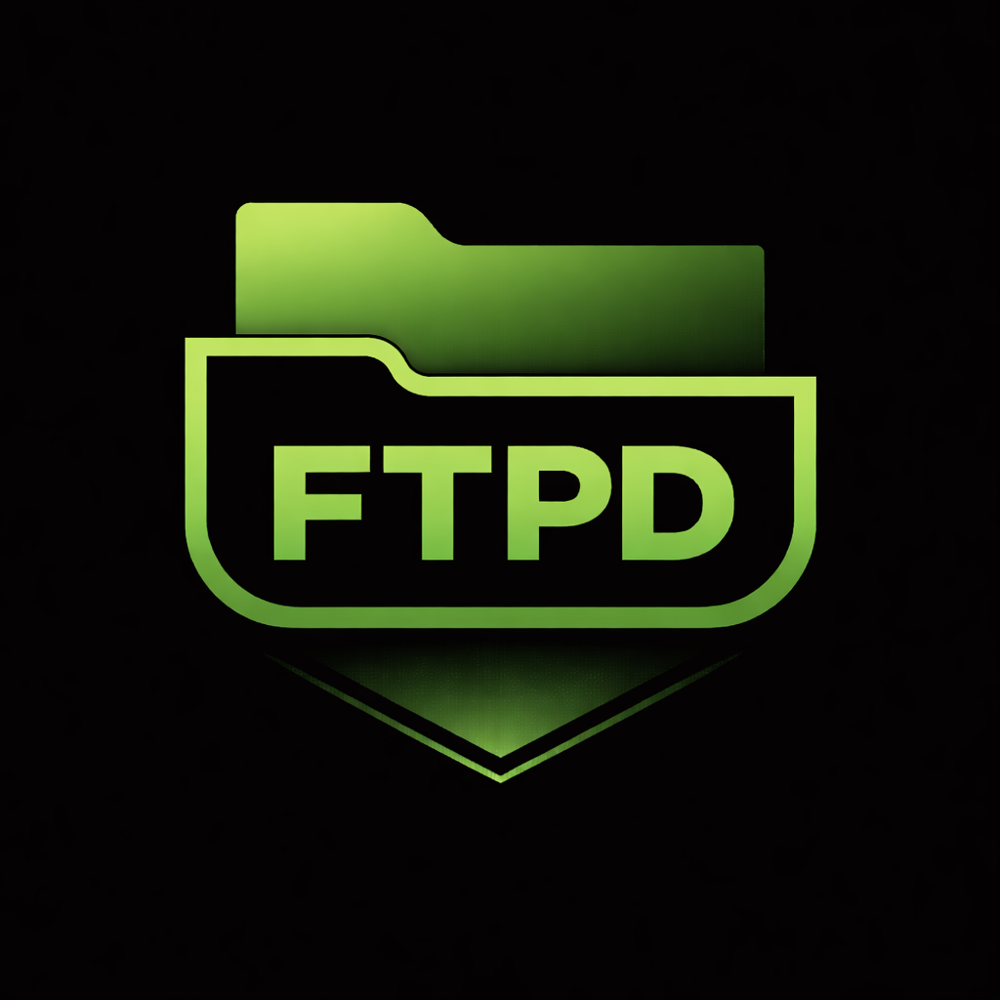

# decky-ftpd



> Transfer files to and from your Steam Deck over Wi-Fi directly from Game Mode, no desktop required.  
> Inspired by ftpd on PSP / PS Vita.

---

## Features

- 📡 Start/stop an FTP server from the Quick Access Menu
- 🔗 Displays your local IP and port connect instantly with any FTP client
- 📁 Full read and write access to the deck
- 🔌 Anonymous login — no credentials to configure
- ⚡ Works entirely offline after install — no internet required on the Deck

---

## Usage

1. Press the **`…`** button to open the Quick Access Menu
2. Open **decky-ftpd** and toggle **Enable FTP Server** ON
3. Your Deck's address will appear in the panel, e.g. `ftp://192.168.1.x:2121`
4. Connect from any FTP client on the same Wi-Fi network

### Connecting

| Field    | Value                        |
|----------|------------------------------|
| Protocol | FTP (not SFTP or FTP-SSL)    |
| Host     | IP shown in the QAM panel    |
| Port     | `2121`                       |
| Username | `anonymous` (or leave blank) |
| Password | *(anything or empty)*        |

### Recommended FTP clients

| Platform | Client |
|----------|--------|
| macOS    | Cyberduck, Transmit, ForkLift |
| Windows  | WinSCP, FileZilla |
| Android  | Solid Explorer, FX File Explorer |
| iOS      | FE File Explorer, Filza |
| Linux    | FileZilla, Nautilus (built-in) |

---

## Notes

- The FTP server shares `/home/deck` — this includes your games, saves, emulators, and homebrew
- The server is only accessible on your **local network** — it is not exposed to the internet
- The server stops automatically when the plugin is unloaded or the Deck shuts down
- Toggle it off when not in use if you are on a shared network

---

## Development

### Prerequisites

- [pnpm](https://pnpm.io)
- Python 3.11+
- A Steam Deck with [Decky Loader](https://decky.xyz) installed

> **Note:** SSH is only required if you want to deploy directly from your dev machine during development. End users installing from the Decky store don't need it.

### Setup

```bash
# Install frontend deps
pnpm install

# Set up Python venv for editor support (optional but recommended)
python3 -m venv .venv
source .venv/bin/activate  # or activate.fish for fish shell
pip install pyftpdlib
```

### Build & Deploy

Copy your Deck's IP into `.env`:

```
DECK_IP=192.168.1.x
```

Then:

```bash
make deploy   # build frontend, create zip, rsync to Deck
make zip      # build + create zip only
make build    # build frontend only
make clean    # remove build artifacts
```

On the Deck, install via **Decky → Settings → Developer → Install Plugin from ZIP**.

---

## Roadmap

- [x] Settings page — custom port, root directory, passive port range
- [ ] Optional username/password auth
- [ ] MicroSD card quick-access shortcut
- [ ] Active connection count in the status line

---

## License

MIT
