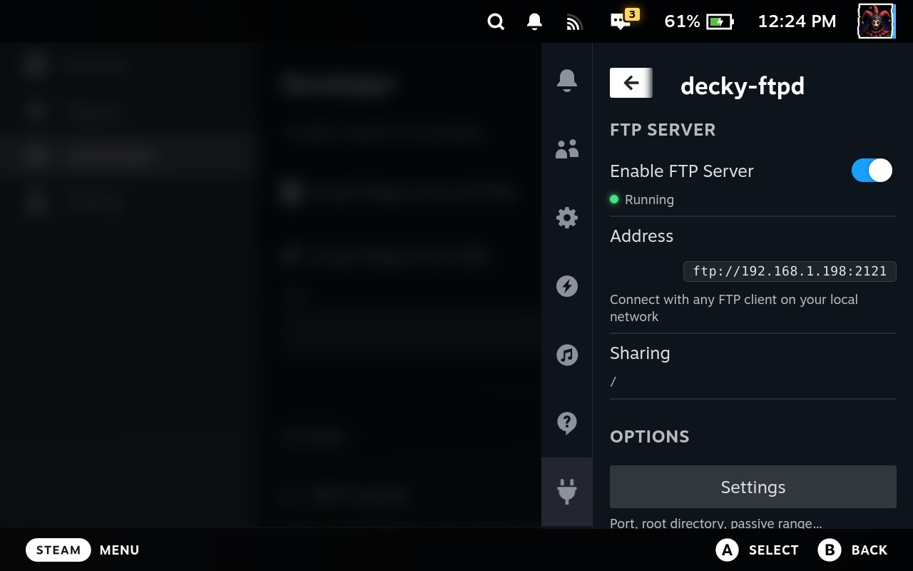
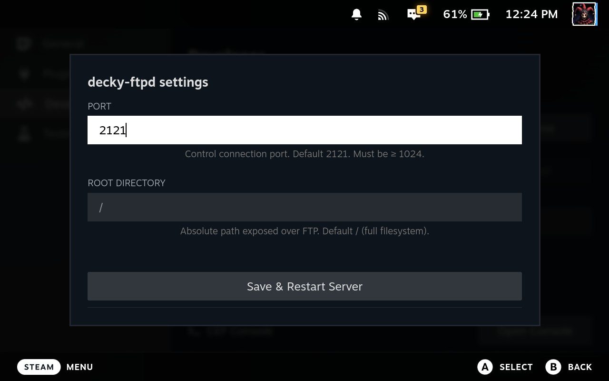

<h1 align="center">
  <br>
  
  <br>
  decky-ftpd
  <br>
</h1>

<h4 align="center">Transfer files to and from your Steam Deck over Wi-Fi directly from Game Mode no desktop required. Inspired by <a href="https://github.com/mtheall/ftpd" target="_blank">ftpd</a> on PSP / PS Vita.</h4>

<p align="center">
  
  
  <a href="https://github.com/codevski/decky-ftpd/releases">
    
  </a>
  
</p>

<p align="center">
  <a href="#key-features">Key Features</a> •
  <a href="#how-to-use">How To Use</a> •
  <a href="#connecting">Connecting</a> •
  <a href="#development">Development</a> •
  <a href="#roadmap">Roadmap</a> •
  <a href="#license">License</a>
</p>

<p align="center">
  
  &nbsp;&nbsp;
  
</p>

## Key Features

* 📡 **Game Mode native** — start and stop the FTP server from the Quick Access Menu
  - No desktop mode, no SSH, no keyboard required.
* 🔗 **Instant connect** — your Deck's local IP and port are displayed right in the panel
* 📁 **Full read/write access** to `/`
  - Games, saves, emulators, homebrew all transferable.
* 🔌 **Zero config** — anonymous login, no credentials to set up
* ⚡ **Fully offline** — no internet required on the Deck after install
* 🛡️ **Local network only** — never exposed to the public internet

## How To Use

1. Press the **`…`** button to open the Quick Access Menu
2. Open **decky-ftpd** and toggle **Enable FTP Server** ON
3. Your Deck's address will appear in the panel, e.g. `ftp://192.168.1.x:2121`
4. Connect from any FTP client on the same Wi-Fi network

### Connecting

| Field    | Value                        |
|----------|------------------------------|
| Protocol | FTP (not SFTP or FTP-SSL)    |
| Host     | IP shown in the QAM panel    |
| Port     | `2121`                       |
| Username | `anonymous` (or leave blank) |
| Password | *(anything or empty)*        |

### Recommended FTP clients

| Platform | Client |
|----------|--------|
| macOS    | Cyberduck, Transmit, ForkLift |
| Windows  | WinSCP, FileZilla |
| Android  | Solid Explorer, FX File Explorer |
| iOS      | FE File Explorer, Filza |
| Linux    | FileZilla, Nautilus (built-in) |

> **Note**
> The server stops automatically when the plugin is unloaded or the Deck shuts down. Toggle it off when not in use if you're on a shared network.

## Development

To clone and run this plugin, you'll need [Git](https://git-scm.com), [pnpm](https://pnpm.io), Python 3.11+, and a Steam Deck with [Decky Loader](https://decky.xyz) installed. From your command line:

```bash
# Clone this repository
$ git clone https://github.com/codevski/decky-ftpd

# Go into the repository
$ cd decky-ftpd

# Install frontend dependencies
$ pnpm install

# Set up Python venv for editor support (optional but recommended)
$ python3 -m venv .venv
$ source .venv/bin/activate  # or activate.fish for fish shell
$ pip install pyftpdlib
```

### Build & Deploy

Copy your Deck's IP into `.env`:

```
DECK_IP=192.168.1.x
```

Then:

```bash
$ make deploy   # build frontend, create zip, rsync to Deck
$ make zip      # build + create zip only
$ make build    # build frontend only
$ make clean    # remove build artifacts
```

On the Deck, install via **Decky → Settings → Developer → Install Plugin from ZIP**.

> **Note**
> SSH is only required if you want to deploy directly from your dev machine during development. End users installing from the Decky store don't need it.

## Download

You can [download](https://github.com/codevski/decky-ftpd/releases) the latest release, or install directly from the Decky Plugin Store.

## Roadmap

- [x] Settings page — custom port, root directory, passive port range
- [ ] Optional username/password auth
- [ ] MicroSD card quick-access shortcut
- [ ] Active connection count in the status line

## Credits

This plugin uses the following open source packages:

- [Decky Loader](https://decky.xyz/)
- [pyftpdlib](https://github.com/giampaolo/pyftpdlib)
- [@decky/api](https://github.com/SteamDeckHomebrew/decky-frontend-lib)
- [React](https://react.dev/)

## You may also like...

- [Decky Loader](https://github.com/SteamDeckHomebrew/decky-loader) — The plugin loader that makes this possible
- [ftpd](https://github.com/mtheall/ftpd) — The original Nintendo Switch / 3DS inspiration

## License

MIT

---

> GitHub [@codevski](https://github.com/codevski)
